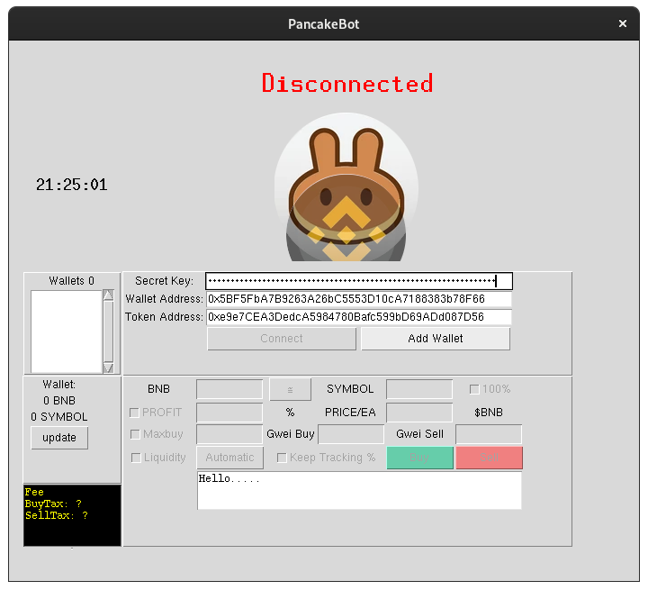
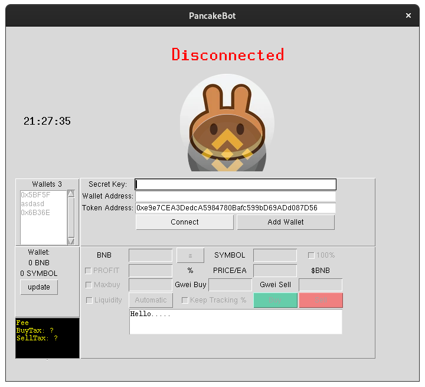
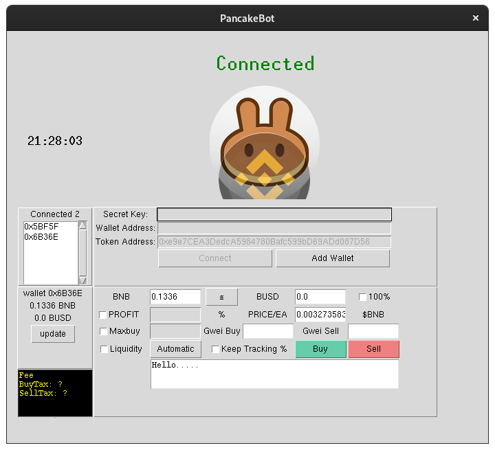
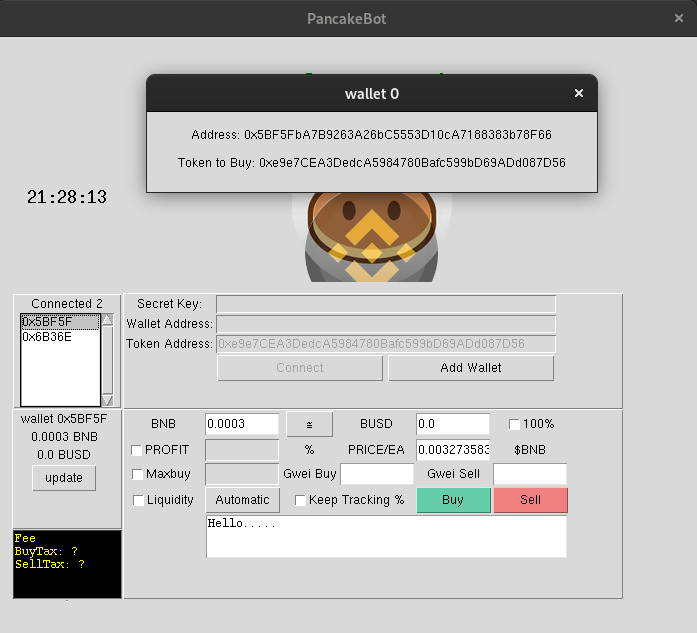

# Python Pancake Bot
This bot was my first time Building a project with programming, try to interact with blockchain and making a readme. I just built this bot because i wanted swap in pancakeswap, and snipe new tokens.

## Download 
- [Linux](https://github.com/Rhuan000/PANCAKEBOT/releases/tag/download)
- [Windows](https://github.com/Rhuan000/PANCAKEBOT/releases/tag/download)
- Or follow the guide to run with git clone. 

## Requirements
- [git](https://git-scm.com/book/en/v2/Getting-Started-Installing-Git)
- [python 3.10+](https://www.python.org/downloads/)
- [Pip](https://pypi.org/project/pip/)


## Getting-started

- Clonning Git:
  ```bash 
  git clone https://github.com/Rhuan000/PANCAKEBOT
  ```

- Installing  External Libraries:<p>
  ```bash 
  pip install asyncio web3 datetime os python-dotenv
  ```


##  Running bot<p>
- Open you terminal, make sure you are inside "PANCAKEBOT" folder and run 
```bash
  python3 main.py
  ``` 
  you will see an image like this: 
  
<p>
  Put your private key and wallet address, then click in "add wallet" (you can decide how many wallets do you want.)<p>

- After you finish, it's time to connect. Click the "Connect" button. The bot will verify the wallet and private key to ensure they belong to the same wallet. If there is any incorrect wallet or private key, it will be removed. 
<p>

- Once you are connected. The wallet who has more BNB, its automatically showed up, now you can use the Trade frame.
<p>

- You can change to the wallet you want clicking inside the listbox of addresses. Once you clicked, will open a new mini window that shows full wallet address and token you want to buy or sell of selected address.
<p>

- ## Showing some Trade Frame Utilities <p> 

  

  ### Entries:
    - "BNB" entry its the BNB amount you want to trade for token (always check and switch for your wallet).<p>
  
    - The "PROFIT" entry is optional. If you choose to provide a value for "PROFIT," it should represent a percentage. For example, if you enter "25" in the "PROFIT" field, the bot will sell the token at a 25% profit based on appreciation.<p>   
      
    - "tokenSymbol" its how much<p>
    
    - "PRICE/EA" shows how much bnb each token its worth in $BNB. Its used with "[Buy](#buy)" and "[Sell](#sell)" Buttons.<br>
    
    - "Maxbuy" its optional, if a token has max buy per transaction or wallet, you just need to provide how much supply is maxbuy(In tokens and not in BNB) for example: 1000000<p>

    - "Gwei Buy" and "Gwei Sell" this entries will change the Gwei to chosen amount. (By default, if you leave blank the amount its gonna be 9.)<p>

  ### Buttons:
    - #### ≅
      Clicking the "≅" button, will convert the amount of BNB for token you want to buy (using live price), and will update the "PRICE/EA" entry.
      <p>
      
    - #### Automatic
      This option will buy tokens for all connected wallets if an event called "Mint" is logged in the blockchain. (You need to mark the Liquidity box so the bot will start listening for the "Mint" event of our target token.)
      This option is used to snipe a token; it's like an auto-buy.<br>
      Entries required: "BNB", "PROFIT"

    - #### Buy
      Will buy Tokens for all wallets connecteds when the Token price is lower than provided "PRICE/EA".<br>
      Entries required: "BNB", "PRICE/EA"
      
    - #### Sell
       Will sell Tokens for all wallets connecteds when the Token price is higher than provided "PRICE/EA".<br>
       Entries required: "BNB", "PRICE/EA"

  ### MarkBox
    - #### 100%
      This option Select All Tokens you have, and works together with [Sell](#Sell). Its used when you want to sell all tokens at once. 
    
    - #### PROFIT
      Will enable  The ["PROFIT"](#"PROFIT") Entry.
    
    - #### Maxbuy
      If the Token has a "Maxbuy", you can parse "Maxbuy" amount of token here to be sure the bot will not fail.

    - #### Liquidity
      Enables the Liquidity Monitoring to use alied with Automatic mode.

    - #### Keep Tracking
      Displays the profit or losses as a percentage. If another purchase is made, the percentage may no longer be accurate.